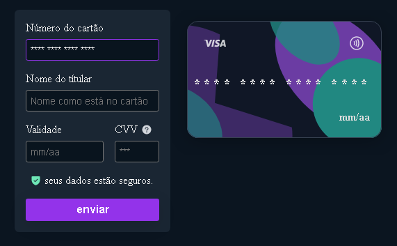
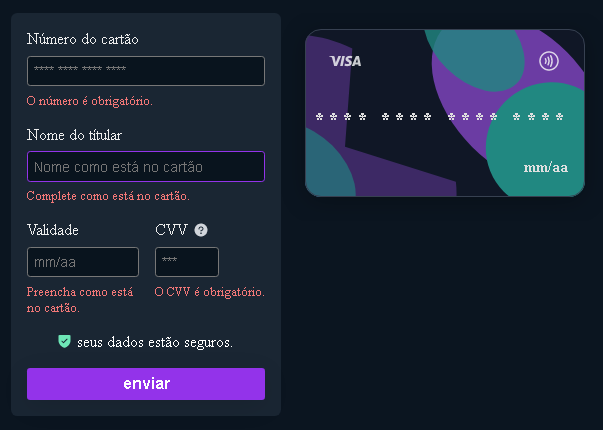
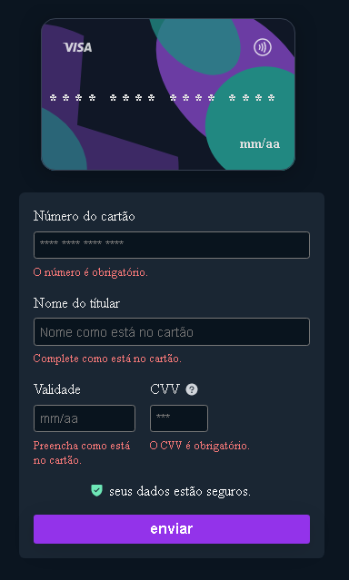

# Formulário de cartão de crédito

### projeto feito para o desafio do #boraCodar apresentado pela Rocketseat.

## 🚀 Tecnologias

- Vite
- React
- react-hook-form
- react-input-mask
- zod

## Obrigado pela atenção ♥

[Veja meu portifólio completo!](https://github.com/renehtar)